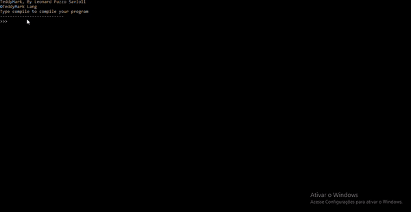

# TeddyMark

A simple hypertext language based on [Markdown](https://github.com/topics/markdown)


## How to use 



## Why?

HTML is a very verbose language and is very difficult fore starters,
and markdown is very very simple, but you can not put atributes, like:
id, class, style and name. So I created a language as simple as markdown,
but you can add this. The name is the union if Teddy the name of my dog and
mark because is a Markup language

## Tags

Also thera are more tags in TeddyMark then markdown, if you want to put a form 
you can use this:

```
{[]}
  ???(type="text")???
{[]}
```

But Lets start in the start. If you want to put a title in markdown you use this:

```
# Title
```

In TeddyMark

```
# Title #
```

And if you want to put an Id:

```
#(id="id") Title #
```

## Links:

* Tags: [](https://github.com/leosavioli2019/TeddyMark/blob/main/Tests/tags.md)
